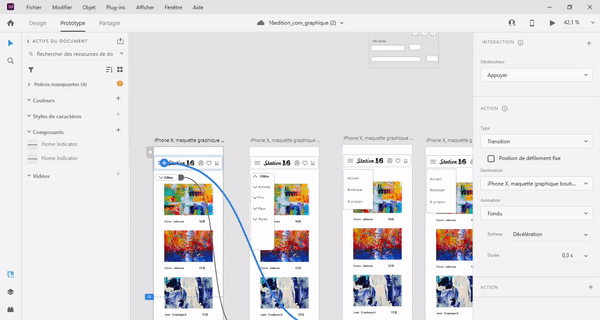
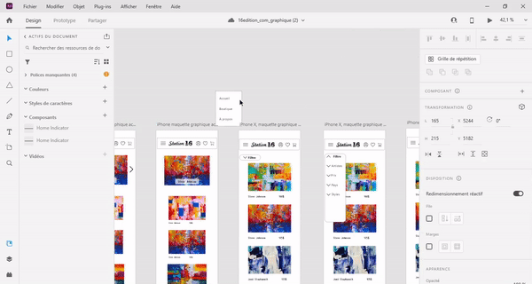
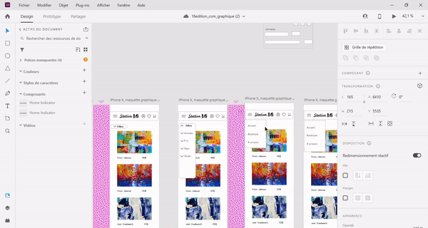

# tutorial pour crée de l'interactivité sur xd
## 1-Ouvrir le fichier dans xd
Dans mon cas c'est 16edition_com_graphique.xd
 
## 2- créé la nouvelle planche

on va copier collé la planche où on veut créé l'interactivité.

## 3- commencer l'interativité
Après avoir dupliqué la planche, on va ajouté l'élément qu'on veut qui apparaisse dans mon cas je voulais faire apparaitre les filtres.

## 4- 

